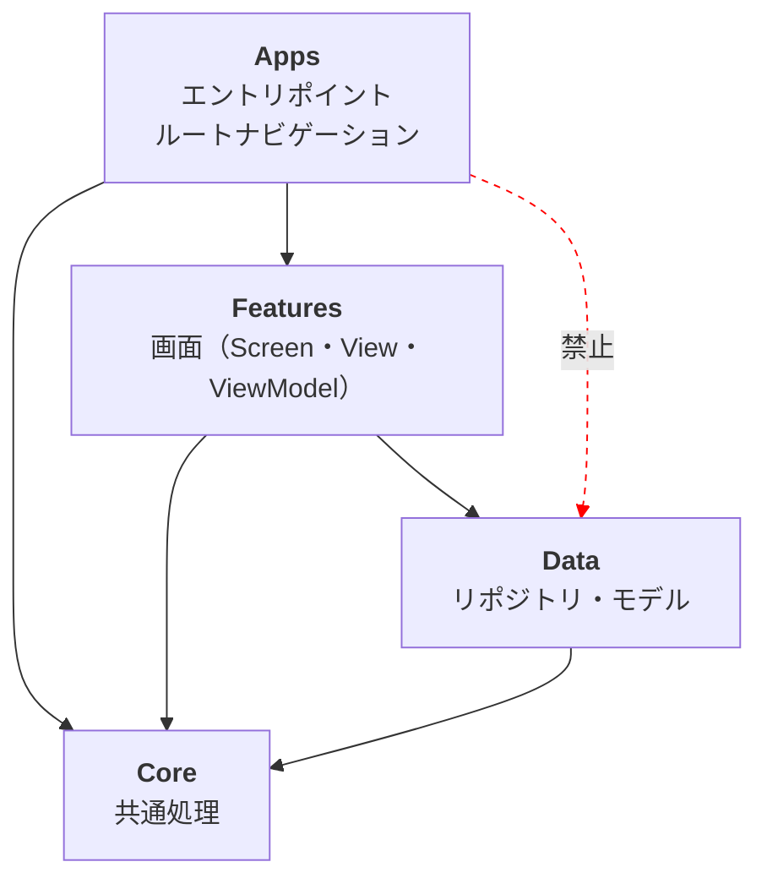
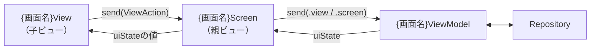
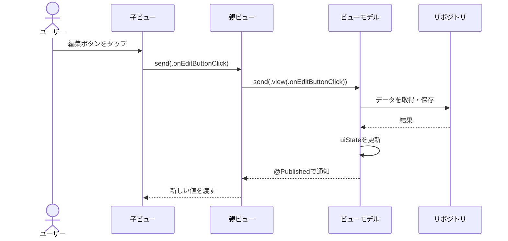

Uhooi iOS Architecture（以下UiA）に則って、iOSアプリを作ったり直したりします。

## UiAとは

SwiftUIアプリ向けのアーキテクチャです。次の2つを組み合わせています。

- [Guide to app architecture](https://developer.android.com/topic/architecture)（Googleが紹介しているAndroidアプリのアーキテクチャ）をiOS向けに移植したもの
- [TCA](https://github.com/pointfreeco/swift-composable-architecture) のアクション

ベースはMVVMです。UIの状態を `uiState` の1つに集約し、ビューからビューモデルへの入力をすべて「アクション」に統一します。

参考実装は [uhooi/Loki](https://github.com/uhooi/Loki) です。迷ったらLokiのソースを見てください。

### 3行でわかるUiA

- アプリを `Apps` ・ `Features` ・ `Data` ・ `Core` の4層に分ける
- 1画面は `Screen` ・ `View` ・ `ViewModel` の3ファイルで作る
- ビューはアクションを送るだけ。状態を変えるのはビューモデルだけ

### なぜアクションを使うのか

ビューモデルにメソッドを生やしていくと、次の問題が起きます。

- 何が呼ばれるのか一覧できない
- どのビューから呼ばれたのか分からない
- ログを仕込むのに全メソッドへ書く必要がある

アクションを `enum` にまとめ、入口を `send()` の1つに絞ると、これらが解決します。ログも `send()` に1行書くだけで全イベントを追えます。

## いつ使うか

- 新規iOSアプリの基盤を作る
- UiAのアプリに画面を追加する
- UiAのアプリの不具合を直す、機能を追加する
- Screen・View・ViewModelのコードをレビューする

## 全体像

### 4層の依存関係

矢印は「依存していい方向」です。逆向きの依存は禁止です。



詳しくは [references/layers.md](references/layers.md) を読んでください。

### 1画面の構成

1つの画面は3ファイルでできています。

```
{画面名}/
├── {画面名}Screen.swift     … 親ビュー。ビューモデルを持つ
├── {画面名}View.swift       … 子ビュー。値を受け取って表示するだけ
└── {画面名}ViewModel.swift  … 状態とロジック
```

### データとアクションの流れ

状態は上から下へ、アクションは下から上へ流れます。



ボタンを押してから画面が変わるまでは、こう動きます。



## 絶対に守るルール

細かいルールは参照ファイルにありますが、次の10個だけは必ず守ってください。

1. 状態はビューモデルの `uiState` に集約する。ビューは `@State` で画面の状態を持たない
2. `uiState` は `private(set)` にする。ビューから直接変更させない
3. ビューからビューモデルへの入力は、すべてアクションにする。ビューモデルにイベント用のメソッドを生やさない
4. 子ビューはビューモデルを参照しない。値とアクションのハンドラを親ビューから受け取る（状態ホイスティング）
5. `@Binding` と `${変数名}` は使わない。 `Binding(get:set:)` を作ってアクションを送る
6. ビューに `if` ・ `switch` を書かない。単体テストを書かないため、分岐はビューモデルへ寄せる
7. ビューに `Task { ... }` を書かない。非同期処理は `sendAsync()` に寄せる
8. ビューモデルは `UIKit` ・ `SwiftUI` をインポートしない
9. エラーは画面ごとに1つの列挙型へまとめ、 `uiState` で1つだけ持つ
10. 逆方向の依存を作らない（Features → Apps 、Data → Features など）

## 作業別の進め方

### 新規アプリを作る

[references/new-app.md](references/new-app.md) の手順どおりに進めてください。

### 画面を追加する

1. どのFeatureモジュールに置くか決める。既存のどれにも属さないなら新しく作る
2. `Sources/Features/{機能名}/{画面名}/` を作る
3. テンプレートから3ファイルを生成する（後述）
4. UI stateとアクションを埋める
5. Appsのルート画面にナビゲーションを追加する
6. ビルドして動きを確認する

テンプレートは `scripts/new-screen.sh` で生成できます。

```shell
$ .claude/skills/uhooi-ios-architecture/scripts/new-screen.sh SakatsuList LokiPackage/Sources/Features/Sakatsu
```

引数は画面名（UpperCamelCase）と、置き先のディレクトリです。 `{置き先}/{画面名}/` に3ファイルを作ります。手で作るときは [assets/templates/](assets/templates/) をコピーして、 `__SCREEN_NAME__` を画面名に、 `__screenName__` をその先頭小文字版に置き換えてください。

### 不具合を直す・機能を追加する

1. 画面の3ファイルを読む。 `uiState` とアクションの一覧を見れば、その画面にできることが分かる
2. 直す場所を決める
    - 見た目だけ → `{画面名}View.swift`
    - 画面全体の見た目（ナビゲーション・ツールバー・シート・アラート） → `{画面名}Screen.swift`
    - 状態やロジック → `{画面名}ViewModel.swift`
    - データの取得や保存 → Data層のリポジトリ
3. 新しいイベントが必要なら、まずアクションを追加する
4. ビルドして動きを確認する

## 参照ファイル

| ファイル | 中身 |
| --- | --- |
| [references/layers.md](references/layers.md) | 4層のモジュール分割と依存のルール |
| [references/ui-layer.md](references/ui-layer.md) | Screen・View・ViewModelとアクションの詳しいルール |
| [references/data-layer.md](references/data-layer.md) | リポジトリ・データソース・モデル・バリデータのルール |
| [references/coding-rules.md](references/coding-rules.md) | 命名・アクセス修飾子・MARKコメントなどのコーディングルール |
| [references/new-app.md](references/new-app.md) | 新規アプリの基盤を作る手順 |
| [assets/templates/](assets/templates/) | Screen・View・ViewModel・子ビューのテンプレート |

## 参考リンク

- [uhooi/Loki](https://github.com/uhooi/Loki) … 参考実装
- [Guide to app architecture](https://developer.android.com/topic/architecture)
- [Guide to Android app modularization](https://developer.android.com/topic/modularization)
- [The Composable Architecture](https://github.com/pointfreeco/swift-composable-architecture)
- [State hoisting](https://developer.android.com/jetpack/compose/state#state-hoisting)
- [Swift API Design Guidelines](https://www.swift.org/documentation/api-design-guidelines/)
