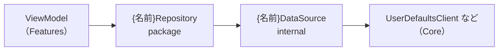

# Data層

データの取得と保存を担当します。Feature層はリポジトリ越しにしかデータへ触れません。

## 構成



```
Sources/Data/{機能名}/
├── Repositories/
│   └── {名前}Repository.swift
├── DataSources/
│   └── {名前}DataSource.swift
├── Models/
│   └── {モデル名}.swift
├── Validators/
│   └── {名前}Validator.swift
└── Resources/
    └── Localizable.xcstrings
```

## リポジトリ

Feature層へ公開する唯一の入口です。

```swift
package protocol SakatsuRepository: Sendable {
    func sakatsus() async throws -> [Sakatsu]
    func saveSakatsus(_ sakatsus: [Sakatsu]) async throws
    func makeDefaultSaunaSet() async -> SaunaSet
}

package final class DefaultSakatsuRepository {
    package static let shared = DefaultSakatsuRepository()

    private let sakatsuDataSource: any SakatsuDataSource

    private init(
        sakatsuDataSource: some SakatsuDataSource = SakatsuUserDefaultsDataSource.shared,
    ) {
        self.sakatsuDataSource = sakatsuDataSource
    }
}

extension DefaultSakatsuRepository: SakatsuRepository {
    package func sakatsus() async throws -> [Sakatsu] {
        try await sakatsuDataSource.sakatsus()
    }
}
```

### ルール

- プロトコル `{名前}Repository` と、実装 `Default{名前}Repository` の2つを作る
- プロトコルは `Sendable` に準拠する
- プロトコルと実装は `package` にする
- `static let shared` を持ち、 `init` は `private` にする
- 依存はデフォルト引数で受け取る
- プロトコルへの準拠は `extension` に分ける
    - 本体には保持するプロパティと `init` だけを書く
- メソッドはすべて `async` にする
    - 実際には同期でも、あとから非同期になっても呼び出し側を変えずに済む
- 取得は名詞（ `sakatsus()` ）、保存は `save{何}()` 、生成は `make{何}()` にする
    - Swift API Design Guidelinesに従い、 `get` は付けない

## データソース

保存先ごとに1つ作ります。モジュールの外へは公開しません。

```swift
protocol SakatsuDataSource: Sendable {
    func sakatsus() async throws -> [Sakatsu]
    func saveSakatsus(_ sakatsus: [Sakatsu]) async throws
}

final class SakatsuUserDefaultsDataSource {
    static let shared = SakatsuUserDefaultsDataSource()

    private let userDefaultsClient: any UserDefaultsClient

    private init(
        userDefaultsClient: some UserDefaultsClient = DefaultUserDefaultsClient.shared,
    ) {
        self.userDefaultsClient = userDefaultsClient
    }
}

extension SakatsuUserDefaultsDataSource: SakatsuDataSource {
    func sakatsus() async throws -> [Sakatsu] {
        do {
            return try await userDefaultsClient.object(forKey: .sakatsus)
        } catch UserDefaultsError.missingValue {
            return []
        } catch {
            throw error
        }
    }
}
```

### ルール

- 命名は `{名前}{保存先}DataSource` （例: `SakatsuUserDefaultsDataSource` ）
    - ローカルとリモートを分けるなら `{名前}LocalDataSource` ・ `{名前}RemoteDataSource` にする
- アクセス修飾子は付けない（internalにする）
    - **Feature層からデータソースを直接触らせないため**
- 「値がない」は正常系として扱い、空配列や初期値を返す
- それ以外のエラーはそのまま投げ、リポジトリ経由でビューモデルまで届ける

## モデル

```swift
package import Foundation

package struct Sakatsu: Identifiable {
    package let id: UUID
    package var facilityName: String = ""
    package var visitingDate: Date = .now

    package init() {
        self.id = UUID()
    }
}

extension Sakatsu: Equatable {
    package static func == (lhs: Sakatsu, rhs: Sakatsu) -> Bool {
        lhs.id == rhs.id
    }
}

extension Sakatsu: Codable {}

#if DEBUG
extension Sakatsu {
    package static var preview: Self {
        var sakatsu = Sakatsu()
        sakatsu.facilityName = "サウナウホーイ"
        return sakatsu
    }
}
#endif
```

### ルール

- `struct` で作る
- IDが必要なら `Identifiable` に準拠し、 `let id: UUID` を `init` で採番する
- プロトコルへの準拠は `extension` に分ける（ `Codable` 、 `Equatable` など）
- プレビューやテスト用の値は `#if DEBUG` の中に `static var preview` として書く
    - これがあるとビューのプレビューが1行で書ける
- 表示用の単位変換はモデルの計算プロパティに閉じ込める
    - 例: 内部は秒で持ち、 `time` は分で出し入れする

```swift
private var _time: TimeInterval?
package var time: TimeInterval? {
    get { _time.map { $0 / 60 } }
    set { _time = newValue.map { $0 * 60 } }
}
```

## バリデータ

入力値のチェックはビューモデルに書かず、Data層のバリデータに置きます。

```swift
package protocol SakatsuValidator {
    func validate(facilityName: String) -> Bool
    func validate(saunaTime: TimeInterval?) -> Bool
}

package struct DefaultSakatsuValidator {
    package init() {}
}

extension DefaultSakatsuValidator: SakatsuValidator {
    package func validate(facilityName: String) -> Bool {
        !facilityName.isEmpty
    }
}
```

### ルール

- メソッド名はすべて `validate` にし、引数ラベルで区別する
- 戻り値は `Bool` にする
- チェックが不要な項目も、いったん `true` を返すメソッドを用意する
    - あとからルールが増えても呼び出し側を変えずに済む
- ビューモデルでは `guard` で弾く

```swift
case let .onFacilityNameChange(facilityName):
    guard validator.validate(facilityName: facilityName) else {
        return
    }
    uiState.sakatsu.facilityName = facilityName
```

## Core層のクライアント

保存先そのものの操作はCore層に置きます。Data層はこれを使います。

```swift
package protocol UserDefaultsClient: Sendable {
    func object<V: Decodable>(forKey key: UserDefaultsKey) async throws -> V
    func set<V: Encodable>(_ value: V, forKey key: UserDefaultsKey) async throws
}
```

- キーは文字列ではなく列挙型 `UserDefaultsKey` にする
- エラーも列挙型 `UserDefaultsError` にし、 `LocalizedError` に準拠する
- `@AppStorage` は使わない。UserDefaultsへのアクセスはData層に寄せる
    - ビュー層のプロパティを永続化したいときだけ、 `View` の中で使っていい
