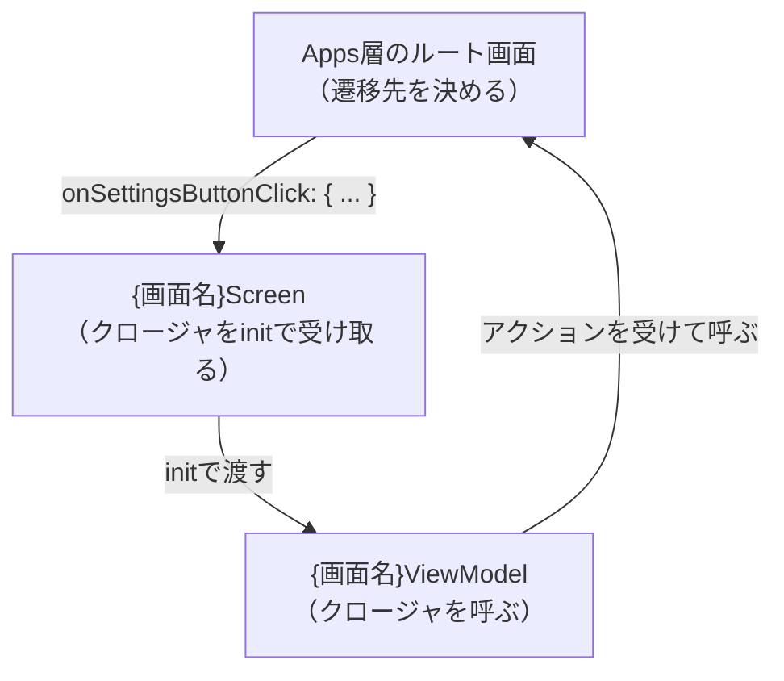

# UI層（Screen・View・ViewModel）

UiAの中心です。1画面はScreen・View・ViewModelの3ファイルで作ります。状態がない画面でも省略しません。

## ファイル構成

```
Sources/Features/{機能名}/
├── {画面名}/
│   ├── {画面名}Screen.swift        … 親ビュー
│   ├── {画面名}View.swift          … 子ビュー
│   ├── {画面名}ViewModel.swift     … 状態とロジック
│   ├── Subviews/
│   │   └── {部品名}View.swift      … さらに細かい子ビュー
│   └── Extensions/
│       └── {型名}+{機能}.swift
└── Resources/
    └── Localizable.xcstrings
```

## 役割の分担

| ファイル | 持つもの | 持たないもの |
| --- | --- | --- |
| `{画面名}Screen` | ビューモデル、ナビゲーション、ツールバー、シート、アラート | 見た目の中身 |
| `{画面名}View` | 画面の中身の見た目 | ビューモデル、状態、ロジック |
| `{画面名}ViewModel` | `uiState` 、ロジック、リポジトリ | UIフレームワーク |

## アクション

UiAの一番の特徴です。ビューからビューモデルへの入力は、すべてアクションにします。

### 4種類の列挙型

1画面につき、次の6つの列挙型を定義します。

| 列挙型 | 定義する場所 | 中身 |
| --- | --- | --- |
| `{画面名}ScreenAction` | `{画面名}Screen.swift` | 親ビューで起きる同期イベント |
| `{画面名}ScreenAsyncAction` | `{画面名}Screen.swift` | 親ビューで起きる非同期イベント |
| `{画面名}ViewAction` | `{画面名}View.swift` | 子ビューで起きる同期イベント |
| `{画面名}ViewAsyncAction` | `{画面名}View.swift` | 子ビューで起きる非同期イベント |
| `{画面名}Action` | `{画面名}ViewModel.swift` | 上2つをまとめたもの |
| `{画面名}AsyncAction` | `{画面名}ViewModel.swift` | 上2つをまとめたもの |

アクションはそれを送るビューのファイルに書きます。ビューモデルのファイルにまとめて書きません。どのビューがどのイベントを持つか、ファイルを開くだけで分かるからです。

```swift
// {画面名}Screen.swift
enum SakatsuListScreenAction {
    case onAddButtonClick
    case onSearchTextChange(searchText: String)
    case onSettingsButtonClick
}

enum SakatsuListScreenAsyncAction {
    case task
}
```

```swift
// {画面名}View.swift
enum SakatsuListViewAction {
    case onCopySakatsuTextButtonClick(sakatsuIndex: Int)
    case onEditButtonClick(sakatsuIndex: Int)
    case onDelete(_ offsets: IndexSet)
}

enum SakatsuListViewAsyncAction {
}
```

```swift
// {画面名}ViewModel.swift
enum SakatsuListAction {
    case screen(_ action: SakatsuListScreenAction)
    case view(_ action: SakatsuListViewAction)
}

enum SakatsuListAsyncAction {
    case screen(_ asyncAction: SakatsuListScreenAsyncAction)
    case view(_ asyncAction: SakatsuListViewAsyncAction)
}
```

**中身が空でも列挙型は必ず定義します。** 空のまま `switch` すると、あとからケースを足したときにコンパイルエラーで気づけます。

```swift
case let .view(viewAsyncAction):
    switch viewAsyncAction {
    }
```

### アクションの命名

- `on{対象}{イベント}` の形にする
    - 例: `onAddButtonClick` 、 `onSearchTextChange` 、 `onErrorAlertDismiss`
- イベントは実際のUIの操作名にする
    - タップ → `Click` （AndroidのCompose由来）
    - 値の変更 → `Change`
    - 閉じる → `Dismiss`
- 「何をするか」ではなく「何が起きたか」を書く
    - ⭕ `onDeleteButtonClick`
    - ❌ `deleteSakatsu`
- 引数はラベルを付ける
    - 例: `case onSearchTextChange(searchText: String)`
    - 型だけで意味が分かるなら `_` でもいい（例: `case onDelete(_ offsets: IndexSet)`）
- ライフサイクルは `task` にする
    - `.task { await viewModel.sendAsync(.screen(.task)) }` に対応する

### 同期と非同期の使い分け

| 種類 | 送るメソッド | 使う場面 |
| --- | --- | --- |
| `Action` | `send(_:)` | ボタンのタップ、値の変更など普通の操作 |
| `AsyncAction` | `sendAsync(_:) async` | `.task` や `.refreshable` など、SwiftUIが非同期を要求する場面 |

`send()` の中で非同期処理が必要なら、ビューモデルの中で `Task { ... }` を作ります。ビューには書きません。

## {画面名}Screen（親ビュー）

### 書くもの

- ビューモデルの保持（ `@StateObject private var` ）
- ナビゲーション（ `NavigationStack` ・ `.navigationTitle()` ・ `.navigationBarTitleDisplayMode()` など）
- 画面全体に関わる表示（ `.toolbar` ・ `.sheet()` ・ `.alert()` ・ `.searchable()` など）
- `.task` からのアクション送信

見た目の中身は書きません。すべて `{画面名}View` に寄せます。

### ファイルの形

```swift
package import SwiftUI
import UICore

// MARK: - Actions

enum SakatsuListScreenAction { ... }

enum SakatsuListScreenAsyncAction { ... }

// MARK: - View

package struct SakatsuListScreen: View {
    @StateObject private var viewModel: SakatsuListViewModel

    @Environment(\.colorScheme) private var colorScheme // swiftlint:disable:this attributes

    package var body: some View {
        SakatsuListView(
            sakatsus: viewModel.uiState.filteredSakatsus,
            send: { action in
                viewModel.send(.view(action))
            },
        )
        .navigationTitle(String(localized: "Sakatsu list", bundle: .module))
        .toolbar {
            toolbarContent(
                sakatsusCount: viewModel.uiState.filteredSakatsus.count,
                onAddButtonClick: { viewModel.send(.screen(.onAddButtonClick)) },
            )
        }
        .errorAlert(
            error: viewModel.uiState.sakatsuListError,
            onDismiss: { viewModel.send(.screen(.onErrorAlertDismiss)) },
        )
        .task {
            await viewModel.sendAsync(.screen(.task))
        }
    }

    package init(onSettingsButtonClick: @escaping () -> Void) {
        self._viewModel = StateObject(wrappedValue: SakatsuListViewModel(
            onSettingsButtonClick: onSettingsButtonClick,
        ))
    }
}

// MARK: - Privates

private extension SakatsuListScreen {
    @ToolbarContentBuilder
    func toolbarContent(...) -> some ToolbarContent { ... }
}

#if DEBUG
// MARK: - Previews

#Preview {
    NavigationStack {
        SakatsuListScreen(onSettingsButtonClick: {})
    }
}
#endif
```

### 暗黙のルール

- MARKコメントの順番を守る
    - `// MARK: - Actions` → `// MARK: - View` → `// MARK: - Privates` → `// MARK: - Previews`
- ビューモデルは `init` で `self._viewModel = StateObject(wrappedValue: ...)` として生成する
- 自分のアクションは `viewModel.send(.screen(...))` で送る
- 子ビューには `send: { action in viewModel.send(.view(action)) }` を渡す
- ツールバーは `private extension` の `@ToolbarContentBuilder func toolbarContent(...)` に切り出す
    - 引数は値とクロージャのみ。 `viewModel` を渡さない（ツールバーにも状態ホイスティングを適用する）
- シートやアラートは `private extension View` のモディファイアに切り出す
- `@Environment` には `// swiftlint:disable:this attributes` を付ける

### `@State` を使っていい場合

原則として状態は `uiState` に集約しますが、SwiftUIの仕組み自体が持つ状態は例外です。

- ⭕ `@Environment(\.colorScheme)` 、 `@Environment(\.dismiss)`
- ⭕ `@State private var editMode: EditMode` のように、SwiftUIのAPIへ渡すためだけの値
- ❌ 画面に表示するデータ、通信結果、入力値、シートの表示フラグ

シートやアラートの表示フラグは `uiState` に持ちます（例: `shouldShowInputScreen` ）。

### Bindingの作り方

`@Binding` や `$変数名` は使いません。 `Binding(get:set:)` を作り、 `set` でアクションを送ります。

```swift
.searchable(
    text: .init(get: {
        viewModel.uiState.searchText
    }, set: { newValue in
        viewModel.send(.screen(.onSearchTextChange(searchText: newValue)))
    }),
)
```

## {画面名}View（子ビュー）

### 書くもの

- 画面の中身の見た目だけ

### ファイルの形

```swift
import SwiftUI
import SakatsuData

// MARK: - Actions

enum SakatsuListViewAction { ... }

enum SakatsuListViewAsyncAction {
}

// MARK: - View

struct SakatsuListView: View {
    let sakatsus: [Sakatsu]
    let send: (SakatsuListViewAction) -> Void

    var body: some View {
        List { ... }
    }
}

// MARK: - Privates

private extension SakatsuListView {
    var generalSection: some View { ... }
}

#if DEBUG
// MARK: - Previews

#Preview {
    SakatsuListView(
        sakatsus: [.preview],
        send: { _ in },
    )
}
#endif
```

### 暗黙のルール

- プロパティは表示する値の `let` と、 `let send: ({アクション名}) -> Void` だけにする
    - `var` や `@Binding` は持たない
    - ビューモデルを参照しない
- `body` が長くなったら `private extension` の計算プロパティへ切り出す
    - 命名は `{セクション名}Section` 、 `{何}View` 、 `{何}Text` など
- 引数を取る部品は `private extension` のメソッドにする
    - 値と `onXxxChange: @escaping (_ value: 型) -> Void` を受け取る
- `if` ・ `switch` はできる限り書かない
    - どうしても必要なら `@ViewBuilder` を付けた計算プロパティに閉じ込める
- プレビューは `#if DEBUG` で囲み、 `send: { _ in }` を渡す

### さらに小さい子ビュー（Subviews）

`Subviews/` に置きます。アクションも自分で持ちます。

```swift
// MARK: - Action

enum SakatsuRowViewAction {
    case onCopySakatsuTextButtonClick
    case onEditButtonClick
}
```

非同期アクションが不要なら、 `{名前}AsyncAction` は作りません。MARKも `// MARK: - Action` と単数にします。

親ビューは子ビューのアクションを受け取り、自分のアクションへ変換して送ります。このとき、子ビューが知らない情報（インデックスなど）を足します。

```swift
SakatsuRowView(
    sakatsu: sakatsu,
    send: { action in
        switch action {
        case .onCopySakatsuTextButtonClick:
            send(.onCopySakatsuTextButtonClick(sakatsuIndex: sakatsuIndex))
        case .onEditButtonClick:
            send(.onEditButtonClick(sakatsuIndex: sakatsuIndex))
        }
    },
)
```

## {画面名}ViewModel

### 書くもの

- `uiState` の定義と保持
- アクションのハンドリング
- リポジトリの呼び出し
- 画面遷移のクロージャの呼び出し

### ファイルの形

```swift
import Combine
import Foundation
import os
import SakatsuData
import LogCore

// MARK: - UI state

struct SakatsuListUiState {
    var sakatsus: [Sakatsu] = []
    var sakatsuListError: SakatsuListError?

    var filteredSakatsus: [Sakatsu] { ... }
}

// MARK: - Actions

enum SakatsuListAction { ... }

enum SakatsuListAsyncAction { ... }

// MARK: - Error

enum SakatsuListError: LocalizedError { ... }

// MARK: - View model

@MainActor
final class SakatsuListViewModel: ObservableObject {
    @Published private(set) var uiState: SakatsuListUiState

    private let onSettingsButtonClick: () -> Void
    private let repository: any SakatsuRepository

    init(
        onSettingsButtonClick: @escaping () -> Void,
        repository: some SakatsuRepository = DefaultSakatsuRepository.shared,
    ) {
        self.uiState = SakatsuListUiState()
        self.onSettingsButtonClick = onSettingsButtonClick
        self.repository = repository
    }

    func send(_ action: SakatsuListAction) {
        let message = "\(#function) action: \(action)"
        Logger.standard.debug("\(message, privacy: .public)")

        switch action {
        case let .screen(screenAction):
            switch screenAction {
            case .onSettingsButtonClick:
                onSettingsButtonClick()
            }

        case let .view(viewAction):
            switch viewAction {
            ...
            }
        }
    }

    func sendAsync(_ asyncAction: SakatsuListAsyncAction) async {
        let message = "\(#function) asyncAction: \(asyncAction)"
        Logger.standard.debug("\(message, privacy: .public)")

        switch asyncAction {
        ...
        }
    }
}

// MARK: - Privates

private extension SakatsuListViewModel {
    func refreshSakatsus() async { ... }
}
```

### 暗黙のルール

- MARKコメントの順番を守る
    - `// MARK: - UI state` → `// MARK: - Actions` → `// MARK: - Error` → `// MARK: - View model` → `// MARK: - Privates`
- `@MainActor` を付けた `final class` にし、 `ObservableObject` に準拠する
    - iOS 16をサポートするため `@Observable` は使わない
- `@Published private(set) var uiState` の1つだけを公開する
- UIフレームワーク（ `UIKit` ・ `SwiftUI` ）をインポートしない
- 依存はすべて `init` の引数で受け取り、デフォルト引数に本番の実装を指定する
    - `repository: some SakatsuRepository = DefaultSakatsuRepository.shared`
    - 型は `some` で受けてプロパティは `any` で持つ
    - こうするとテストでモックへ差し替えられる
- ログを出すなら `send()` と `sendAsync()` の先頭に書く
    - 入口が1つなので、1行書くだけでその画面のイベントをすべて追える
- `switch` は必ず網羅する。 `default` を書かない
- 各ケースは1つの空行で区切る
- ロジックが長くなったら `private extension` のメソッドへ切り出す
- `send()` が長くなったら `// swiftlint:disable:this cyclomatic_complexity function_body_length` を付ける

### UI state

- 構造体名は `{画面名}UiState` （ `UIState` ではない。Android由来）
- `var` のプロパティで持つ
- 表示用の加工は計算プロパティにする

```swift
struct SakatsuListUiState {
    var sakatsus: [Sakatsu] = []
    var searchText: String = ""

    var filteredSakatsus: [Sakatsu] {
        sakatsus.filter { ... }
    }
}
```

- シートやアラートの表示フラグも持つ
    - 表示条件が値の有無なら `String?` のように任意型で持ち、 `nil` でないときに表示する

### エラー

- 画面ごとに1つの列挙型 `{画面名}Error` にまとめる
- `LocalizedError` に準拠する
- `uiState` では1つだけ持つ（ `var {画面名}Error: {画面名}Error?` ）
    - アラートが同時に2つ出ないことを型で保証できる
- 閉じたら `nil` に戻す

```swift
enum SakatsuInputError: LocalizedError {
    case saunaSetRemoveFailed
    case sakatsuSaveFailed

    var errorDescription: String? { ... }
    var failureReason: String? { ... }
    var recoverySuggestion: String? { ... }
}
```

エラーメッセージの作り方は2通りあります。

- 画面で文言を決める → `String(localized:bundle:.module)` を返す
- 下の層のメッセージをそのまま出す → `case xxxFailed(localizedDescription: String)` にして受け取る

表示は `UICore` の `errorAlert(error:onDismiss:)` を使います。

### 非同期処理とキャンセル

- `send()` の中で非同期が必要なら `Task { ... }` を作る
- `sendAsync()` はそのまま `await` する
- キャンセルは握りつぶす。エラーとして表示しない

```swift
func refreshSakatsus() async {
    do {
        uiState.sakatsus = try await repository.sakatsus()
    } catch is CancellationError {
        // Do nothing when cancelled
    } catch {
        uiState.sakatsuListError = .sakatsuFetchFailed(localizedDescription: error.localizedDescription)
    }
}
```

### 楽観的更新

削除のように、先に画面を更新してから保存する場合は、失敗したら元に戻します。

```swift
case let .onDelete(offsets: offsets):
    let oldValue = uiState.sakatsus
    // uiStateから削除する
    Task {
        do {
            try await repository.saveSakatsus(uiState.sakatsus)
        } catch {
            uiState.sakatsuListError = .sakatsuDeleteFailed(localizedDescription: error.localizedDescription)
            uiState.sakatsus = oldValue
        }
    }
```

## 画面遷移

Featureモジュール同士は依存できません。そのため、画面遷移は次の流れで行います。



1. Screenの `init` で `on{何}ButtonClick: @escaping () -> Void` を受け取る
2. そのままビューモデルへ渡す
3. ビューモデルはアクションを受けたらクロージャを呼ぶ
4. Apps層のルート画面が、遷移先の画面を組み立てる

Apps層では、画面の生成を `private extension` の `make{画面名}Screen()` にまとめます。

```swift
// MARK: - Screen factory

private extension ProductionRootScreen {
    func makeSakatsuListScreen() -> some View {
        SakatsuListScreen(onSettingsButtonClick: {
            isSettingsScreenPresented = true
        })
        .navigationDestination(isPresented: $isSettingsScreenPresented) {
            makeSettingsScreen()
        }
    }
}
```

ルート画面だけは `@State` で遷移のフラグを持ちます。

## 状態がない画面

状態もロジックもない画面でも、Screen・View・ViewModelの3ファイルを作ります。省略しません。

- どの画面も同じ形になり、読むときに迷わない
- あとから状態が増えても、構成を変えずに済む

閉じる操作は `@Environment(\.dismiss)` を使います。

## 単体テスト

- ビューは単体テストを書かない
    - UIは手動でテストすることが多く、費用対効果に合わない
    - だからこそ、ビューに分岐やロジックを書きません
- ビューモデルとData層はテストを書ける
    - 依存をデフォルト引数で受けているため、モックに差し替えられる
